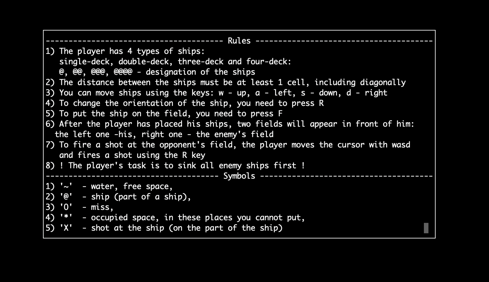

# Морской бой
(Домашнее задание №2, по АЯ, Заботин Дмитрий, ИУ8-21)

## Задание:
Написать игру морской бой. (Должны соблюдаться все правила игры);

## Требования
1. 2 поля 10х10, первое - поле пользователя, второе поле - противника (в данном случае компьютера).
   
2. Пользователь должен играть против компьютера.
   
3. Компьютер должен обладать примитивным искусственным интеллектом (оценивать ситуацию на поле, выбирать места ударов и т.д.).
   
4. При потоплении корабля вокруг него автоматически должен производиться обстрел.
   
5. Должна быть проверка на выход за границы поля (при расстановке кораблей и при обстреле).
   
6. Должна быть возможность ставить корабли горизонтально и вертикально.
   
7. Корабли нельзя ставить рядом (между ними должна быть минимум одна клетка).

## Install:
// for mac package manager is brew, for linux is (sudo) apt-get
brew install libncurses5-dev libncursesw5-dev

## Build:
cmake -H. -B_build
cmake --build _build
_build/demo

## Run:
/game_directory/cmake-build-debug/

./demo

## Элементы управления:

### Расстановка:

1. Перемещение по полю: w, a, s, d;
2. F - поставить корабль;
3. R - повернуть корабль (вертикально- горизонтально);
4. Конец игры - нажать q для выхода;

### Игра:

1. Перемещение по полю: w, a, s, d;
2. R - выстрел;
3. Конец игры - нажать q для выхода;

### Меню:

1. Перемешение стрелка вверх, стрелка вниз;
2. Выбор опции: enter;

### Варианты игры:

1. ИИ против ИИ
2. ИИ против игрока

